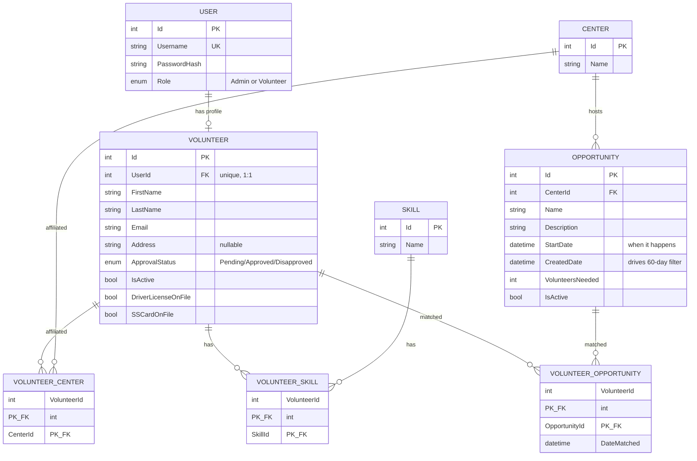

# Database Schema

```mermaid
erDiagram
  USER ||--o| VOLUNTEER : "has profile"
  CENTER ||--o{ OPPORTUNITY : hosts
  VOLUNTEER ||--o{ VOLUNTEER_CENTER : "affiliated"
  CENTER ||--o{ VOLUNTEER_CENTER : "affiliated"
  VOLUNTEER ||--o{ VOLUNTEER_SKILL : has
  SKILL ||--o{ VOLUNTEER_SKILL : has
  VOLUNTEER ||--o{ VOLUNTEER_OPPORTUNITY : matched
  OPPORTUNITY ||--o{ VOLUNTEER_OPPORTUNITY : matched
  USER {
    int Id PK
    string Username UK
    string PasswordHash
    enum Role "Admin or Volunteer"
  }
  VOLUNTEER {
    int Id PK
    int UserId FK "unique, 1:1"
    string FirstName
    string LastName
    string Email
    string Address "nullable"
    enum ApprovalStatus "Pending/Approved/Disapproved"
    bool IsActive
    bool DriverLicenseOnFile
    bool SSCardOnFile
  }
  OPPORTUNITY {
    int Id PK
    int CenterId FK
    string Name
    string Description
    datetime StartDate "when it happens"
    datetime CreatedDate "drives 60-day filter"
    int VolunteersNeeded
    bool IsActive
  }
  CENTER {
    int Id PK
    string Name
  }
  SKILL {
    int Id PK
    string Name
  }
  VOLUNTEER_CENTER {
    int VolunteerId PK_FK
    int CenterId PK_FK
  }
  VOLUNTEER_SKILL {
    int VolunteerId PK_FK
    int SkillId PK_FK
  }
  VOLUNTEER_OPPORTUNITY {
    int VolunteerId PK_FK
    int OpportunityId PK_FK
    datetime DateMatched
  }
```